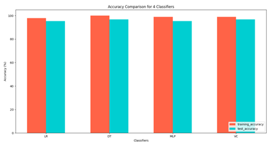
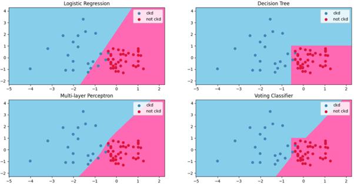

# UnderstandingVotingClassifiers
Voting classifier is a type of ensemble method in statistical machine learning which infers with consensus. In other words, the final prediction is based on class with majority votes. The goal of this work is to shed light on why ensemble methods are regarded as a superior option than a one-man-show classifier model, through visualizing the decision boundaries of the classifier.

## Methodology
For a greater detail of explanation, check out this [report](https://github.com/TzeLun/UnderstandingVotingClassifiers/blob/main/Visual%20Understanding%20of%20Voting%20Classifier.pdf). 
The task is a binary classification and 4 models are considered for this experiment: Logistic Regression (LR), decision trees (DT), multi-layer perceptron (MLP), and a soft voting classifier (VC), to which VC is made up of those three classifiers. The dataset is the [chronic kidney disease](https://archive.ics.uci.edu/dataset/336/chronic+kidney+disease) and the class labels are chronic kidney disease (CKD) or non-CKD. The dataset is splitted into 60% training data and 40% test data.

## Results
The bar chart highlights the training and testing accuracy of each classifier:  
  
|Classifier|Training Accuracy (%)|Test Accuracy (%)|Difference (%)|
|-----|-----|-----|-----|
|Logistic regression|97.872|95.312|2.560|
|Decision tree|100.00|96.875|3.125|
|Multi-layer perceptron|98.936|95.313|3.623|
|Soft voting classifier|98.936|96.875|2.061|  

The accuracy of VC is affected by all three classifiers. The error of LR and MLP during training is seen to have propagated to VC, as the training accuracy wasn't 100%, as opposed to DT. Let's visualize their decision boundaries:  

  

All data used for the decision boundaries are the test data. The linear decision boundary of LR led to some misclassification. Though MLP has a non-linear classification region, there is still some samples misclassified. On the other hand, the decision boundary of VC is an amalgamation of all three classifiers'. It has the geometrical boundaries of DT and a slightly right-skewed non-linear boundaries, leading to a better performance.

## Conclusion
Through observations, the voting classifier is capable of selecting the strength of each classifier and making it its own peculiarity. It is recommended to have a wide variety of good performing classifier with different decision boundaries which allows the voting classifier to characterize a unique classification region to which individual classifiers are unable to achieve.
